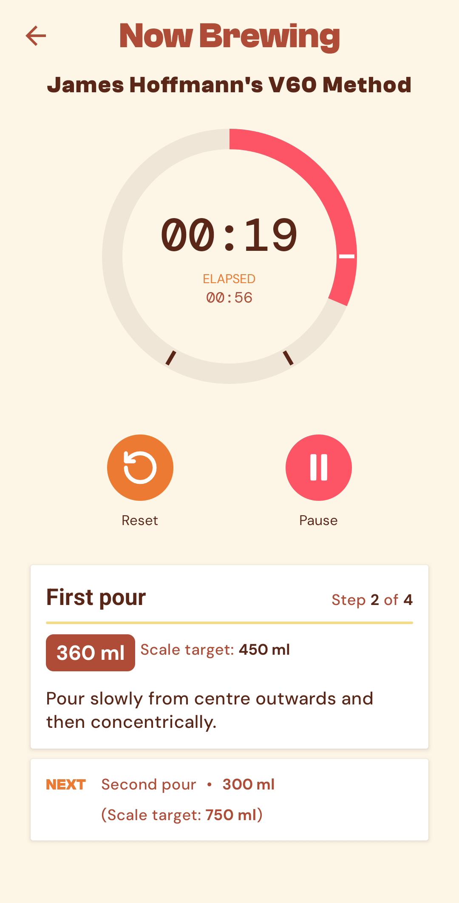
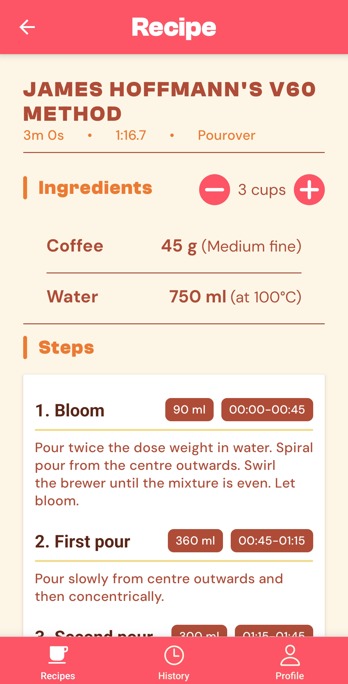
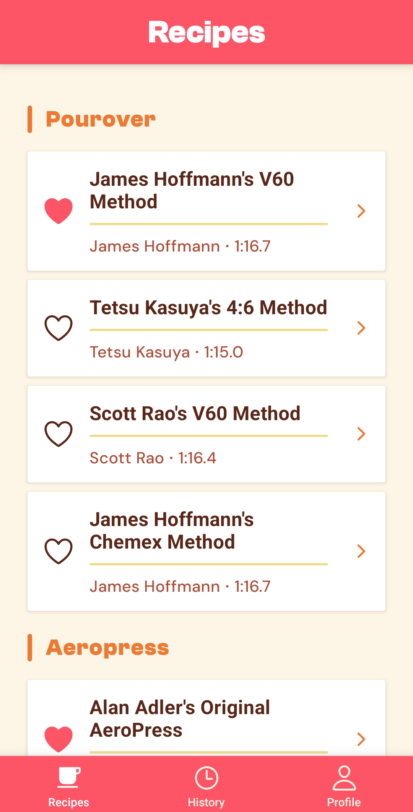

<a id="readme-top"></a>

<!-- PROJECT SHIELDS -->
[![License][license-shield]][license-url]
[![LinkedIn][linkedin-shield]][linkedin-url]

<!-- PROJECT LOGO -->
<br />
<div align="center">
  <a href="https://github.com/Wuggynaut/porina">
    
  </a>

<h1>Porina</h1>
  <p>Specialty Coffee Brewing Companion</p>

  <p>
    Browse curated brewing recipes, follow guided step-by-step timer, and track your coffee brews.
  </p>
</div>

<!-- SCREENSHOTS -->
## Screenshots

<div align="center">

  
  
</div>

<br />

<!-- ABOUT -->
## About

Porina is a mobile app for specialty coffee enthusiasts. Users pick a recipe, adjust it to their desired serving size, and follow along with an interactive timer that guides each pour. Completed brews can be logged with personal notes and ratings for future reference.

This project was built as a learning exercise for React Native with Expo.

### Key Features

- **Recipe browser.** Organized by brew method (pourover, AeroPress, French press), with favorites
- **Dynamic scaling.** Ingredient amounts and pour targets adjust to your chosen serving count
- **Segmented pour-over timer.** Step-by-step guidance, haptic feedback, and audio cues. Works also as a simple countdown timer for immersion methods
- **Brew history log.** Notes and star ratings, synced across devices via Firestore

<p align="right">(<a href="#readme-top">back to top</a>)</p>

### Built With

- [React Native](https://reactnative.dev/) + [Expo](https://expo.dev/). Cross-platform mobile framework
- [Expo Router](https://docs.expo.dev/router/introduction/). File-based navigation with tab + stack navigators
- [React Native Reanimated](https://docs.swmansion.com/react-native-reanimated/). Timer progress ring animation and step card transitions
- [Firebase Auth](https://firebase.google.com/docs/auth). User accounts
- [Cloud Firestore](https://firebase.google.com/docs/firestore). Brew history and favorites (real-time sync)
- [expo-haptics](https://docs.expo.dev/versions/latest/sdk/haptics/) + [expo-av](https://docs.expo.dev/versions/latest/sdk/audio/). Vibration and audio feedback at pour step transitions
- [expo-keep-awake](https://docs.expo.dev/versions/latest/sdk/keep-awake/). Prevents screen sleep during brewing

<p align="right">(<a href="#readme-top">back to top</a>)</p>

## Architecture Notes

**Recipes are bundled as local JSON** rather than fetched from Firestore. The recipe set is curated and changes infrequently, so shipping it with the app avoids a network round-trip on the main screen and makes the recipe browser work fully offline. If the recipe catalog grows or user recipes are added as a feature, migrating to Firestore is straightforward since the data shape already matches.

**The brew flow uses a modal stack** (`app/brew/`) separate from the tab navigator. This keeps the timer isolated from tab navigation and a user can't accidentally swipe to the history tab mid-brew and lose their session.

**Timer logic lives in a custom `useBrewTimer` hook** that manages step progression, pause/resume, and elapsed time tracking independent of the UI. The timer component handles only rendering and animations, while the hook owns the state machine. The hook accepts `onStepChange` and `onFinish` callbacks, which the screen uses to fire haptics and audio.

**Context API for active session state**. The app's shared state is small (auth, favorites) and doesn't change rapidly.

<p align="right">(<a href="#readme-top">back to top</a>)</p>

<!-- GETTING STARTED -->
## Getting Started

### Prerequisites

- [Node.js](https://nodejs.org/) (v18+)
- [Expo CLI](https://docs.expo.dev/get-started/installation/)
- An Android device/emulator (the app is developed and tested on Android)
- A [Firebase](https://firebase.google.com/) project with Authentication and Firestore enabled

### Installation

1. Clone the repo
   ```sh
   git clone https://github.com/github_username/porina.git
   cd porina
   ```

2. Install dependencies
   ```sh
   npm install
   ```

3. Set up Firebase

   Create a Firebase project and enable **Email/Password authentication** and **Cloud Firestore**.

   Then create `firebase/config.ts` with your project credentials:
   ```ts
   import { initializeApp } from "firebase/app";
   import { getAuth } from "firebase/auth";
   import { getFirestore } from "firebase/firestore";

   const firebaseConfig = {
     apiKey: "YOUR_API_KEY",
     authDomain: "YOUR_PROJECT.firebaseapp.com",
     projectId: "YOUR_PROJECT_ID",
     storageBucket: "YOUR_PROJECT.appspot.com",
     messagingSenderId: "YOUR_SENDER_ID",
     appId: "YOUR_APP_ID",
   };

   const app = initializeApp(firebaseConfig);
   export const auth = getAuth(app);
   export const db = getFirestore(app);
   ```

   > **Note:** `firebase/config.ts` is gitignored. Do not commit your Firebase credentials.

4. Start the dev server
   ```sh
   npx expo start
   ```

   Press `a` to open on a connected Android device or emulator.

<p align="right">(<a href="#readme-top">back to top</a>)</p>

<!-- PROJECT STRUCTURE -->
## Project Structure

```
app/
├── _layout.tsx              # Root layout: fonts, auth gate, providers
├── (auth)/                  # Login screen
├── (tabs)/                  # Main tab navigator
│   ├── recipes/             # Recipe list + detail screens
│   ├── history/             # Brew log list + detail screens
│   └── profile/             # User profile + sign out
└── brew/                    # Modal stack: timer + log screens
    ├── [id].tsx             # Brew timer with step progression
    └── log.tsx              # Post-brew logging (rating, notes)

src/
├── components/              # Reusable UI (Button, Card, ProgressRing, etc.)
├── context/                 # AuthContext, FavoritesContext
├── data/                    # Local recipe JSON + index
├── hooks/                   # useBrewTimer, useBrewSounds
├── services/                # Firestore CRUD (brewLogService)
├── types/                   # TypeScript types (brew.ts)
├── utils/                   # Formatting helpers
└── theme.ts                 # Colors, spacing, typography, fonts
```

<p align="right">(<a href="#readme-top">back to top</a>)</p>

<!-- ROADMAP -->
## Future additions

- [ ] Guest mode. Browse recipes and use the timer without creating an account
- [ ] Offline support. Queue brew logs written offline and sync when connectivity returns
- [ ] User-created and customized recipes.
- [ ] Recipe filtering
- [ ] Stats and data export
- [ ] Dark mode
- [ ] Other visual, and feedback polish

See the [open issues](https://github.com/Wuggynaut/porina/issues) for bug reports and additional feature requests.

<p align="right">(<a href="#readme-top">back to top</a>)</p>


<!-- LICENSE -->
## License

Distributed under the MIT License. See `LICENSE` for more information.

<p align="right">(<a href="#readme-top">back to top</a>)</p>

<!-- ACKNOWLEDGMENTS -->
## Acknowledgments

- Fonts: [Clash Grotesk](https://www.fontshare.com/fonts/clash-grotesk) by Indian Type Foundry, [DM Sans](https://fonts.google.com/specimen/DM+Sans) and [DM Mono](https://fonts.google.com/specimen/DM+Mono) by Colophon Foundry
- Icons: [Ionicons](https://ionic.io/ionicons) and [Lucide](https://lucide.dev/)

<!-- Add any recipe sources, tutorials, or other credits here -->

<p align="right">(<a href="#readme-top">back to top</a>)</p>

<!-- MARKDOWN LINKS & IMAGES -->
[license-shield]: https://img.shields.io/github/license/Wuggynaut/porina.svg?style=for-the-badge
[license-url]: https://github.com/Wuggynaut/porina/blob/main/LICENSE
[linkedin-shield]: https://img.shields.io/badge/-LinkedIn-black.svg?style=for-the-badge&logo=linkedin&colorB=555
[linkedin-url]: https://linkedin.com/in/ari-matti-toivonen-b7689187